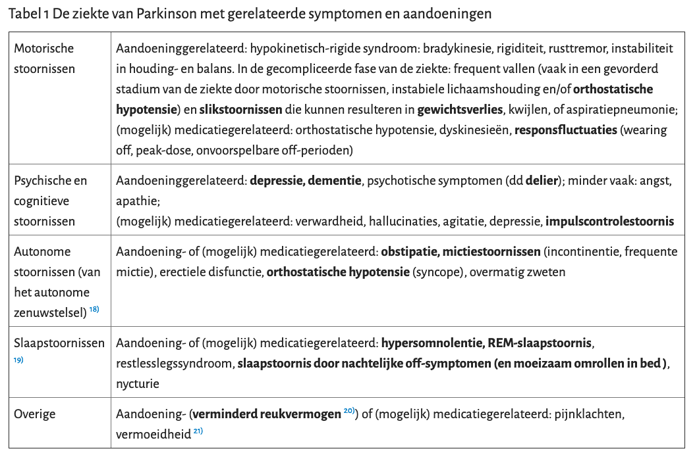
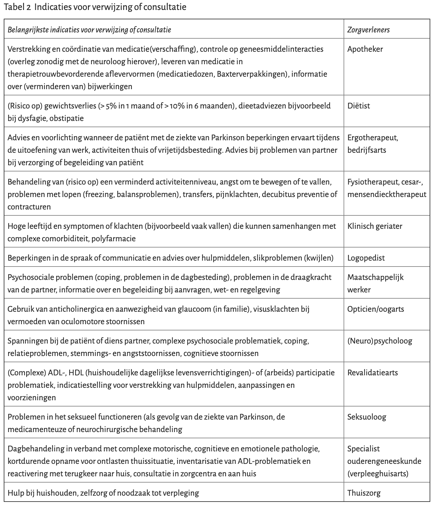

# Parkinson

MARTIEN ORANJE

Note:

Ik heb een tijdje als assistent neurologie gewerkt in Alkmaar waar ik heel erg weinig in aanraking ben gekomen met patienten met de ziekte van Parkinson. Wel heb ik een opmerkelijk filmpje opgedaan.

---

<!-- .slide: data-background-iframe="https://www.youtube-nocookie.com/embed/aaY3gz5tJSk" data-background-interactive -->

---

## Leerdoelen

- Herkennen van de eerste ziekteverschijnselen
- Signaleren van problemen tijdens de ziekte
- Veilig medicatie voorschrijven bij Parkinson
- Kennis van hulp en hulpmiddelen

Note:

Het is een groot onderwerp en hoewel zal proberen een rode draad door de ziekte te tekenen zijn er zeker zaken die niet aan bod komen.

---

## Pathofysiologie

> Neurodegeneratieve aandoening

- Klinische diagnose
- Typische en atypische vormen
- Verlies van neuronen

Note:

- Na de ziekte van Alzheimer de meest voorkomende neurodegeneratieve aandoening
- Geen gouden standaard

===

## Verlies van dopamine

 <!-- .element height="500px" -->

Note:

- Klachten treden op ongeveer 60-80% reductie van de dopamine productie

===

## Pathways basale ganglia

 <!-- .element height="500px" -->

Note:
Basale ganglia groep kernen samen verandwoordelijk voor oa aansturing van bewegingen (soort buffer die zorgt voor nauwkeurige starten en remmen van bewegingen)

- Wijs aan waar het (dopaminerge) probleem zit
- De dopamine afname wordt veroorzaakt door verlies van neuronen in de substantia nigra
- Directe pathway zorgt voor het initieren van de beweging
- Indirectie pathway onderdukt de (overtollige) bewegingen

===

## Andere problemen

- Stapeling van Lewy body deeltjes
- Andere neurotransmitters (serotonine, noradrenaline, acetylcholine)
- Tractus olfactorius: reuk

Note:

- Lewy body deeltjes in het stroma van de neuronen in de substantia nigra: belangrijkste vinding in post mortem studies. Functie hiervan is niet bekend.
- Serotine disbalans zorg voor een gestoord slaap waak ritme

---

## Epidemiologie

- Prevalantie van _8,95 per 1000_ mannen en _6,53 per 1000_ vrouwen
- Incidentie _0,2_ tot _0,3_ per 1000 per jaar in Nederland
- Indicentie stijgt met leeftijd gemiddeld _60 jaar_
- Minder dan _5%_ krijgt het voor leeftijd _40 jaar_
- Kortere levensverwachting, sterfterisico in 10 jaar _verdubbeld_

Note:

- Gemiddeld ziet de huisarts met een normpraktijk 1 nieuwe patiënt met de ziekte van Parkinson per 1 à 2 jaar
- Ongeveer 80% van de patiënten met de ziekte van Parkinson is ouder dan 65 jaar. Door vergrijzing zal de prevalentie toenemen.
- Korte levensverwachtin tov leeftijdsgenoten zonder de ziekte

---

## Quiz

**Juist** is _groen_ <!-- .element: style="color: green" -->

**Onjuist** is _rood_ <!-- .element: style="color: red" -->

===

## Vraag 1

_Typisch voor de ziekte van Parkinson is een tremor in een volledig ondersteund en ontspannen lichaamsdeel_

Note:

Een rusttremor is te onderscheiden van een essentiele tremor en een intentietremor (meestal fijnslagig, hoge frequentie, niet in rust en erger bij bewegingen, meestal symmetrisch) en intentietremor (ataxie, grofslagig, progressief verergerend hoe dichter het doel van de beweging bereikt wordt, cerebellair probleem)

Ongeveer 2/3e van de patienten met de ziekte van Parkinson heeft een tremor.

Rusttremor (4-6 Hz);

===

## Vraag 2

_De ziekte van Parkison presenteert zich meestal met symmetrische bilaterale symptomen_

Note:

Hier kom ik later op terug

===

## Vraag 3

_Bij verdenking dementie bij Parkinson kan MMSE gebruikt worden_

Note:

48-80% van de patienten wordt dement tijdens de ziekte

Sensitiviteit kan worden verhoogd door test van 25 naar 26 te verhogen.
Of [SCOPA-COG](http://www.parkinsoninzorg.nl/wp-content/uploads/2015/05/SCOPA-COG-NL.pdf)
Indien twijfel blijft bestaan kan doorverwezen worden voor neuropsychologisch onderzoek

===

## Vraag 4

_Een impulscontrole stoornis komt vaker voor bij patienten < 45 jaar met Parkinson_

Note:

Een impulscontrolestoornis komt voor bij ongeveer 10% van de patiënten met de ziekte van Parkinson. Vooral jongere patiënten (< 45 jaar) hebben een verhoogd risico op het ontwikkelen van een impulscontrolestoornis, wat zich meestal uit in een verslaving op het gebied van gokken, seksualiteit, winkelen, eten of het compulsief gebruik van dopaminerge medicatie (dopaminedysregulatiesyndroom). 15) Een impulscontrolestoornis kan ook pas na jarenlang gebruik van dopamine-agonisten ontstaan. Dit gaat vaak gepaard met gevoelens van schuld en schaamte en wordt weinig spontaan gemeld.

===

## Vraag 5

_Het is voor het ziektebeloop belangrijk om de ziekte zo vroeg mogelijk te behandelen_

Note:

De behandeling van de ziekte van Parkinson is symptomatisch. Er zijn tot nu toe geen behandelingen die de progressie van de ziekte afremmen.

===

## Vraag 6

_Als de patient onder behandeling is in het ziekenhuis vervolgt huisarts patient op indicatie_

---

# Het eerste contact

---

## Casus

> Meneer de Wit

- 67 jaar
- Voorgeschiedenis: weinig
- Intoxicaties: roken, 25 jaar geleden gestopt, 30 py
- Paroxetine 10mg
- Gestuurd door zijn vrouw vanwege loopstoornissen

Note:

Op je spreekuur verschijnt de 67 jarige meneer de Wit. Hij was 1,5 jaar geleden voor het laatst met hoestklachten. Weinig voorgeschiedenis en hij gebruikt al jaren Paroxetine 10mg waarmee zijn depressieve klachten stabiel zijn.

Hij wordt gestuurd door zijn vrouw omdat hij minder goed is gaan lopen. Vroeger wandelde zij lange afstanden maar het laatste jaar gaat dat minder goed. Hij loopt trager en zijn rechter been wil niet goed meer mee. Hij is heeft af en toe het gevoel dat hij zou kunnen vallen, maar dat is nog niet gebeurd. Daarnaast is hem de afgelopen maanden opgevallen dat zijn rechterhand een beetje trilt. Links geen klachten.

---

## Symptomen

- Bradykinesie
- EN rigiditeit, rusttremor, houdings- en balansstoornissen

### Ondersteundende kenmerken

- Unilateraal begin
- Progressief beloop
- Ontbreken van andere oorzaken van een hypokinetisch rigide syndroom

<!-- .element: style="font-size: 80%" -->

Note:

Geen dopamine dus bewegingsarmoede. Tremor, schuifelend voorover gebogen looppatroon, verminderde armzwaai, verhoogde tonus, tandradfenomeen, micrografie en maskergelaat kunnen bij het lichamelijk onderzoek worden gevonden

Symptomen in de casus passend bij Parkinson: alle

Beschermende factoren

- roken (nicotine?)

===

### Bewegingsarmoede

- Medicatie (tardieve dyskinesie) zoals antipsychotica en anti-emetica (metoclopramide)
- Vasculair parkinsonisme
- Zeldame oorzaken (PSP, MSA etc.)

<!-- .element: style="font-size: 80%" -->

### Tremor

- Essentiele tremor
- Geneesmiddelen: lithium, levothyroxine, Depakine, _bronchusverwijders_, antidepressiva
- Fysiologische tremor: onttrekking van benzo's of alcohol, hyperthyreoidie, hypoglycemie, door roken of caffeinehoudende dranken
- Intentietremor: cerebellaire stoornis

<!-- .element: style="font-size: 80%" -->

Note:

Bronchusverwijders: sympathicomimetica, xanthinederivaten
Geneesmiddelen: natriumvalproaat (Depakine), antidepressiva (SSRI's meer dan TCA's)
Fysiologische tremor: verergering van fysiologische tremor

---

## Casus: vervolg

Patient gebruikt geen andere medicatie. Drinkt max _1 a 2 EH_ alcohol per week en drinkt de meeste dagen _1 kop_ koffie en geen andere caffeinehoudende dranken. Hij rookt _echt_ niet. Er is geen plots begin geweest van de klachten, daarmee is een vascualire oorzaak onwaarschijnlijk. U besluit de Paroxetine twee weken te staken en lab af te nemen (TSH, nuchter glucose).

Na twee weken ziet u patient terug. Het lab liet niets bijzonders zien en de klachten zijn niet veranderd na het staken van de medicatie.

Note:
Op wat voor termijn verwijs je nu? 6 weken

---

## Typen

- Tremordominante type, TD-type
- Postural imbalance and gait disorder type, PIGD-type

Note:

Wellicht kom je deze afkortingen ergens tegen.

Verschilldende typen Parkinson, een type waarbij een (rust)tremor op de voorgrond staat (tremordominante type, TD-type) en een type waarbij houdings-, balans- en loopstoornissen op de voorgrond staan (postural imbalance and gait disorder type, PIGD-type). Bij het type met loopstoornissen of bij het ontstaan van loopstoornissen en verdwijnen van de tremor is het risico op dementie in het beloop van de aandoening groter dan bij het TD-type.

---

## Ziektebeloop

- Vroege of ongecompliceerde fase
- Gecompliceerde fase
- Eindfase

Note:

Waarschijnlijk een 3 - 6 jaar durende asymptomatische fase waarbij schade aan substantia nigra op PET scans wordt gezien.

Vroege of ongecompliceerde fase: uni- of bilateraal beeld zonder evenwichtsstoornissen.

Gecompliceerde fase: bilateraal beeld met evenwichtsstoornissen en functiebeperkingen maar nog wel in staat om zelfstandig te lopen.

Bij progressie van het ziektebeeld (gecompliceerde fase) kunnen voorspelbare (wearing off en peak-dose dyskinesieën) en later ook onvoorspelbare motorische symptomen (off-perioden) gaan optreden

Eindfase: rolstoelafhankelijk of lopen is alleen met hulp mogelijk.

---

## Casus: de diagnose

Meneer de wit wordt ingestuurd naar de neuroloog. Deze stelt vast dat het om de ziekte van Parkinson gaat. Hij wordt ingesteld op levodopa (Sinemet) en hoewel het even duurt om de juiste dosis te vinden, verdwijnen zijn klachten bijna helemaal en kan hij weer wandelen met zijn vrouw. Hij blijft onder controle bij de neuroloog en de parkinsonverpleegkundige.

_Spreek je controles af met de patient, zo ja met welke frequentie?_

===

## Behandeling (skip)

- Levodopa
- Dopamineagonisten
- Anticholinergica
- Duodopa pomp
- Amantadine
- Deep-brain stimulation

Note:

Levodopa wordt verpakt met DDI die er voor zorgen dat het medicijn niet gemetaboliseerd kan worden, echter DDI's kunnen de bloed hersenbarriere niet passeren

Na het begin van responsfluctuaties kunnen

- andere medicijnen worden gestart als MOA-B remmers, amantadine, COMT-remmers
- intraduodenale levodopa/carbidopa (duodopa-pomp)
- diepe hersenstimulatie (bij patienten zonder cognitieve stoornissen)

---

# Tijdens de ziekte

---

## Samenwerking

- Rol neuroloog: verantwoordelijk voor medicamenteuze beleid
- Rol parkinsonverpleegkundige: coordinatie multidisciplinaire zorg
- Rol huisarts
  - Controle bijwerkingen/veranderingen in de effectiviteit medicatie
  - Behandelen van nieuwe klachten
  - Controle op psychosociale problemen bij de patiënt of zijn partner
  - Intensiveren en coördineren van zorg bij eindstadium parkinson of de palliatieve fase

<!-- .element: style="font-size: 80%" -->

Note:

Zorgverleners op ParkinsonNet

- Signaleren van bijwerkingen en veranderingen in de effectiviteit of het gebruik van de medicatie. Dit kan aanleiding zijn om (vervroegd) de neuroloog te consulteren.
- Signaleren, diagnosticeren en behandelen van nieuw ontstane symptomen of aandoeningen die aan de ziekte van Parkinson zijn gerelateerd (of hiervoor verwijzen naar de neuroloog of overige zorgverleners).
- Intensiveren en coördineren van zorg bij patiënten die zich in het eindstadium of de palliatieve fase 31) van de aandoening bevinden (en alleen behandeling in de thuissituatie wensen).
- Signaleren van psychosociale problemen bij de patiënt of zijn partner.

===

<iframe src="https://www.parkinsonzorgzoeker.nl/#/search?location=Schagen,%20Nederland&spec=Specialist" height="600px" width="1000px"/>

===

<!-- .slide: data-background="images/parkinson_symptomen.png" data-background-size="contain" -->

Note:

Deze lijst staat opgenomen in de NHG standaard. Er is overlap tussen de symptomen die worden veroorzaakt door de ziekte en de symptomen die worden veroorzaakt door medicatie. Bij twijfel overleg neuroloog.

===

## Minimaal 1 keer per jaar controle

===

<!-- .slide: data-background="images/samenwerking.png" data-background-size="contain" -->

Note:

---

# Spoed situaties

---

## Casus: verward

Je krijgt een telefoontje van de wijkverpleging. Het gaat niet goed met meneer de Wit. Hij was eerder die dag vanwege buikpijn op je spreekuur. Toen vond je niet veel bijzonders en heb je hem macrogol en diclofenac voorgeschreven. Nu heeft hij hevige pijn in de rechter onderbuik en bovendien lijkt hij dingen te zien die er niet zijn. Bij aankomst is patient gedesorienteerd, heeft een wisselende aandacht en grijpt af en toe in het luchtledige. Diffuus mild drukpijnlijke buik. Normale vitale parameters. Geen aawijzingen voor pneumonie of UWI.

---

## Haloperidol

> Blokkeert zowel dopaminerge (D2) als α1-adrenerge receptoren en vermoedelijk ook de dopaminereceptoren in de chemoreceptor trigger-zone

Alternatief: Clozapine _6,25mg_

Note:

Overleggen met neuroloog frequentie van controles te bespreken

Clozapine is effectief bij de behandeling van psychotische symptomen bij de
ZvP, zonder dat dit resulteert in een toename van de
Parkinsonverschijnselen. Echter, het gebruik van clozapine vergt regelmatige
bloedcontroles om het eventuele optreden van agranulocytose te detecteren

Er is onvoldoende bewijs voor de effectiviteit van quetiapine als antipsychoticum bij de ZvP. Quetiapine is wel relatief veilig en vergt geen
hematologische bloedcontroles.

---

## Take home

- 1 keer per jaar controle
- Laagdrempelig contact met neuroloog of parkinsonverpleegkundige
- Multidisciplinaire zorg, ParkinsonNet

---

## Referenties

- [NHG-standaard Ziekte van Parkinson](https://www.nhg.org/standaarden/volledig/nhg-standaard-ziekte-van-parkinson)
- Neurology: A Queen Square Textbook, Second edition
- NHG nascholing. [PIN Ziekte van Parkinson](https://portal.nhg.org/course/view.php?id=293)
- Khan Academy: [Parkinsons Disease](https://www.khanacademy.org/science/health-and-medicine/nervous-system-diseases/parkinsons-disease)
- Patienteninformatie [Tremor](https://www.neurologie.nl/publiek/patientenvoorlichting/tremor) NvvN
- [Multidisciplinaire Richtlijn Ziekte van Parkinson](https://www.nhg.org/sites/default/files/content/nhg_org/uploads/parkinson_0.pdf)
- Farmacothepeutisch kompas: [haloperidol](https://www.farmacotherapeutischkompas.nl/bladeren/preparaatteksten/h/haloperidol#eigenschappen)

<!-- .element: style="font-size: 70%" -->
