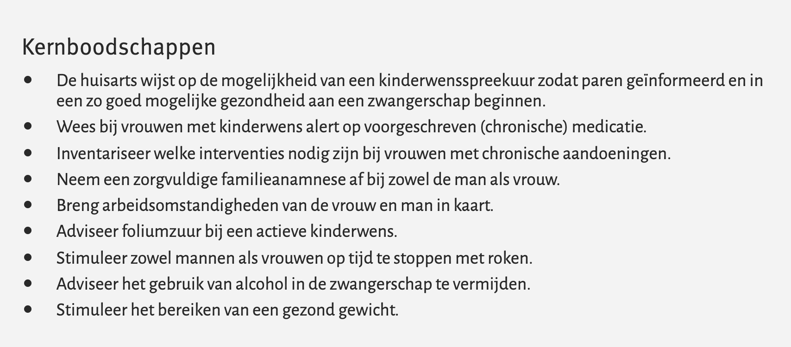

# Preconceptiezorg

MARTIEN ORANJE

---

## Preconceptiezorg

[Video](https://player.vimeo.com/video/241847525)

---

## Kahoot

[Linkje](https://play.kahoot.it/v2/?quizId=accc1313-5eed-4234-b7e7-fa450d12ffd4)

---

## 1 - Preconceptiezorg is in principe op indicatie, verantwoordelijkheid bij de patient

---

## 2 - Het preconceptieve consult moet bij een verloskundige of gynaecoloog plaatsvinden

---

## 3 - Ouders zouden programmatisch moeten worden opgeroepen voor preconceptiezorg

---

## 4 - Het preconceptieve consult moet direct worden ingepland bij stellen van relevante diagnoses

---

## 5 - De huisarts moet lager opgeleiden en allochtonen actief uitnodigen voor preconceptiezorg

---

## 6 - Ouders worden gelukkiger van het krijgen van een kind

---

## Take Home

---

## Literatuur

- NHG-Standaard Preconceptiezorg
- NHG-Standaard Zwangerschap en kraamperiode
- Preconceptie Indicatie Lijst (PIL) ‘Multidisciplinaire samenwerkingsafspraken’
- Zwangerwijzer
